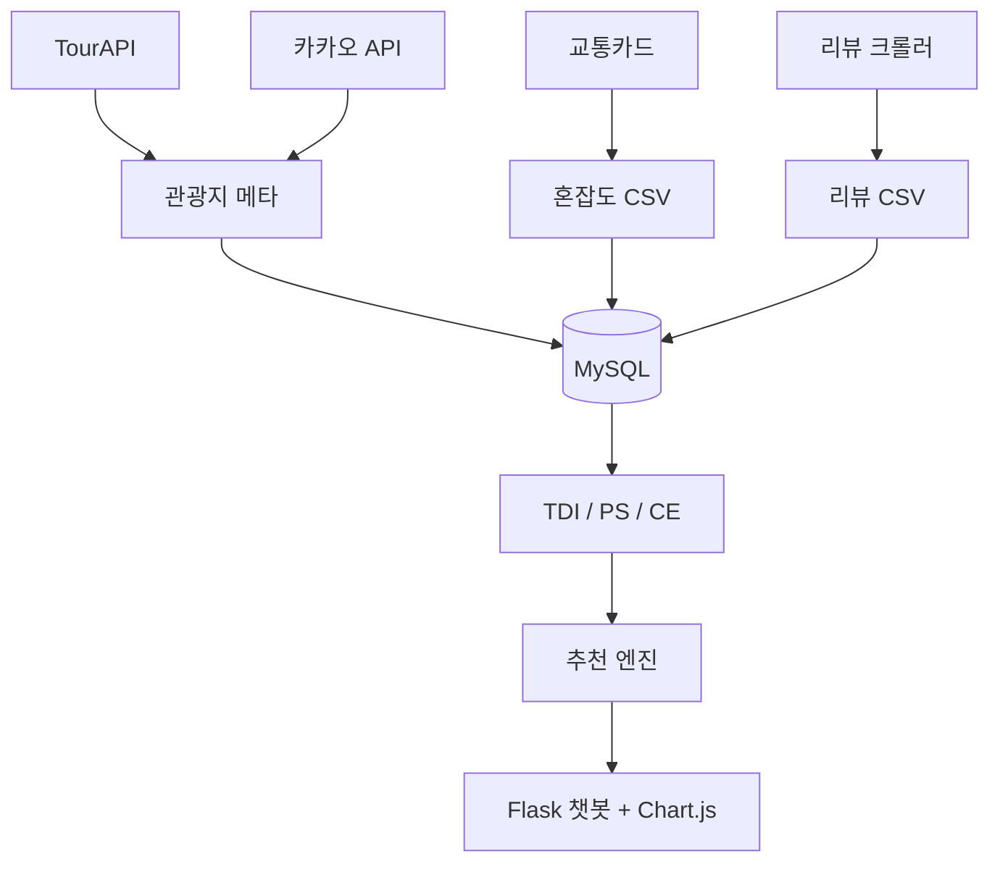
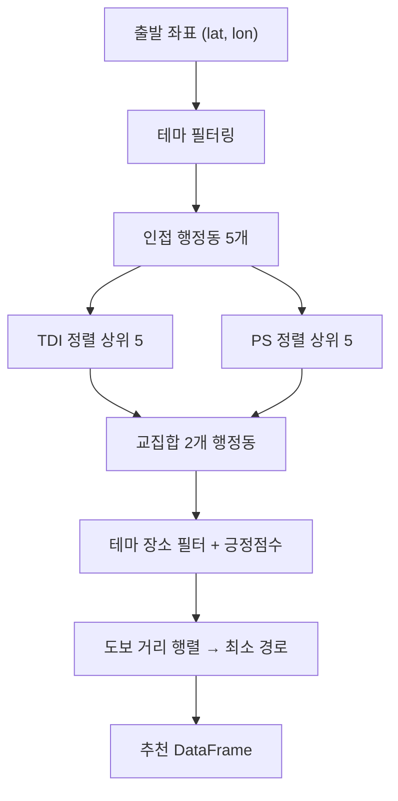
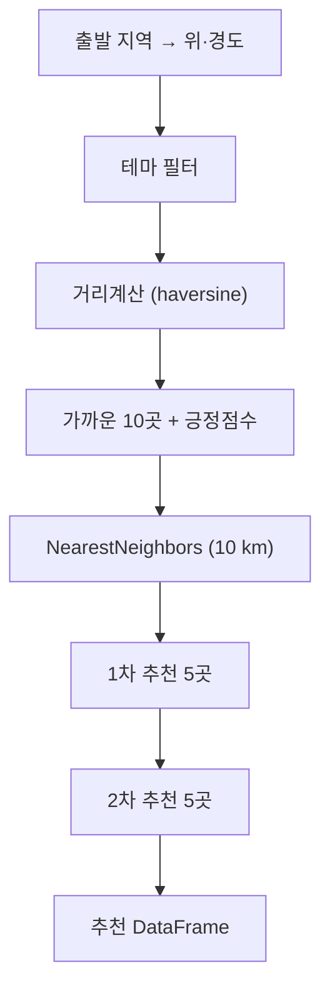

# 🗺️ 관광지수 · 인기도지수 · 혼잡도지수 + 추천 챗봇

데이터 기반 **다양성(TDI)·인기도(PS)·혼잡도(CE)** 지수를 결합해  
**언제·어디·어떻게** 여행하면 좋은지 실시간으로 알려주는 챗봇 서비스입니다.

---

## 1. 프로젝트 목표
- 여행 정보를 *수치화*해 “데이터로 증명하는 경로”를 제안  
- 세 지수를 통합해 **콘텐츠 품질**과 **현장 붐빔**을 동시에 고려  
- Flask‑기반 챗봇 + PNG 그래프로 직관적 UX 제공

## 2. 모듈 개요

| 모듈 | 핵심 역할 | 산출물 |
|------|-----------|--------|
| **TDI** | 행정동×카테고리 빈도로 **다양성 지수** 계산 | 힐링·액티비티·문화 점수 |
| **PS** | 리뷰수·별점·감성으로 **인기도 지수** 계산 | 인기도 점수 |
| **CE** | 교통카드 빅데이터로 **혼잡도 지수** 계산 | 시간대별 등급 |
| **Recommend / People** | 세 지수 통합 + 경로 최적화 + 그래프 출력 | 추천 표 + PNG |

## 3. 데이터 & 아키텍처

## 3‑b. 데이터 처리·운영 스택  
| 계층 | 상세 | 비고 |
|------|------|------|
| **ETL** | **Airflow DAG → MySQL** | 관광지·리뷰·혼잡도 CSV 매일 적재 |
| **캐싱** | **Redis** (지오코딩·쿼리 TTL 24 h) | 응답 속도 300 ms 유지 |
| **배포** | **Docker Compose + Nginx SSL** | `docker compose up -d` 한 줄 배포 |

## 4. 주요 지수 하이라이트

### 4‑1. 관광지수 (TDI)

| 지표 | 평균 | 75% 분위 | 해석 |
|------|------|---------|------|
| 관광지 총합 | **21.4** | 32 | 강남·마포 상위 |
| 엔트로피 | **1.31** | 1.48 | 0 = 단일 → > 1.5 = 균형 |
| 힐링 : 문화 | 1 : 0.92 | — | 연남·북촌 균형 우수 |

> 💡 다양성 Top 10 % 행정동은 “데이트+맛집” 코스 핵심 후보

### 4‑2. 인기도지수 (PS)

| 변수 | 평균 | 75% | 비고 |
|------|------|-----|------|
| Log 리뷰수 | **3.12** | 4.08 | 리뷰 22 → 59 개 |
| 베이지안 별점 | **4.32** | 4.71 | 리뷰수 보정 적용 |
| 긍정 감성비율 | **0.78** | 0.87 | 감성모델 F1 = 0.91 |

> 💡 리뷰 < 10 건이면 별점 편향 ↑ → 가중치 0.5× 감쇠

### 4‑3. 혼잡도지수 (CE)

| 시간대 | level ≥ 3 비율 | 패턴 |
|-------|--------------|------|
| 평일 07‑09 | 54 % | 출근 피크 |
| 주말 11‑15 | **61 %** | 관광 붐빔 |
| 평일 21‑06 | 9 % | 여유 |

## 5. 추천 엔진 프로세스
#### 5‑1. 두 행정동 도보 루트

#### 5-2. 대중교통 1,2차 확장

